```python
async def my_job(sleep_time):
    await asyncio.sleep(sleep_time)

sleep2 = asyncio.create_task(my_job(2))
sleep3 = asyncio.create_task(my_job(3))
await my_job(2)
await sleep2
await sleep3
```

```mermaid
gantt
    title Task Execution (mix)
    dateFormat s
    axisFormat %Ss
    section Tasks
    create_task(my_job(2))   :a, 0, 2s
    create_task(my_job(3))   :b, 0, 3s
    section Awaits
    await my_job(2) (blocks) :crit, c, 0, 2s
    await sleep2 (done)      :done, d, 2, 0s
    await sleep3 (1s left)   :crit, e, 2, 1s
```

