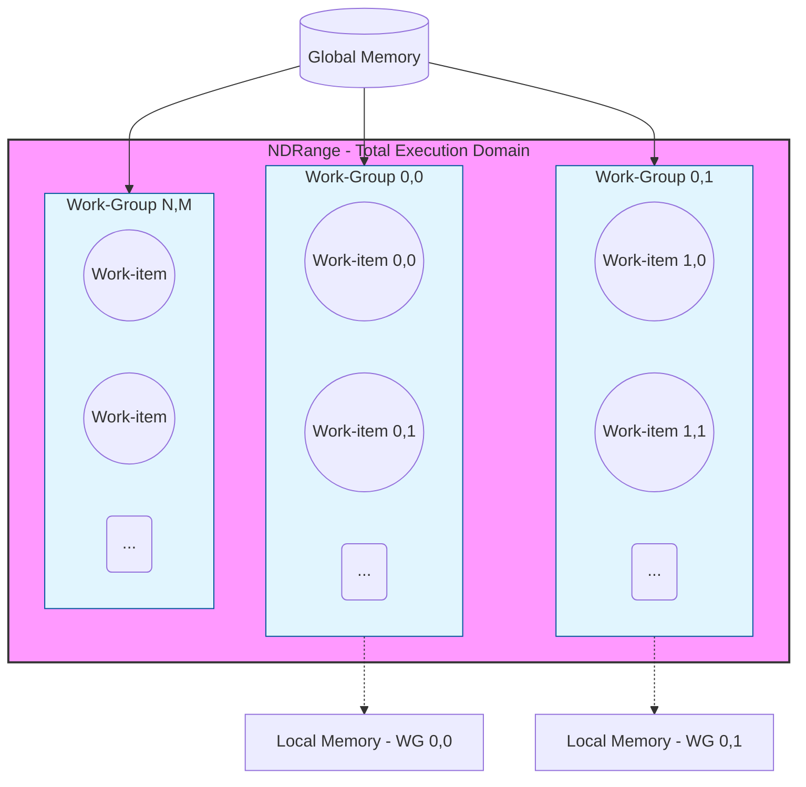
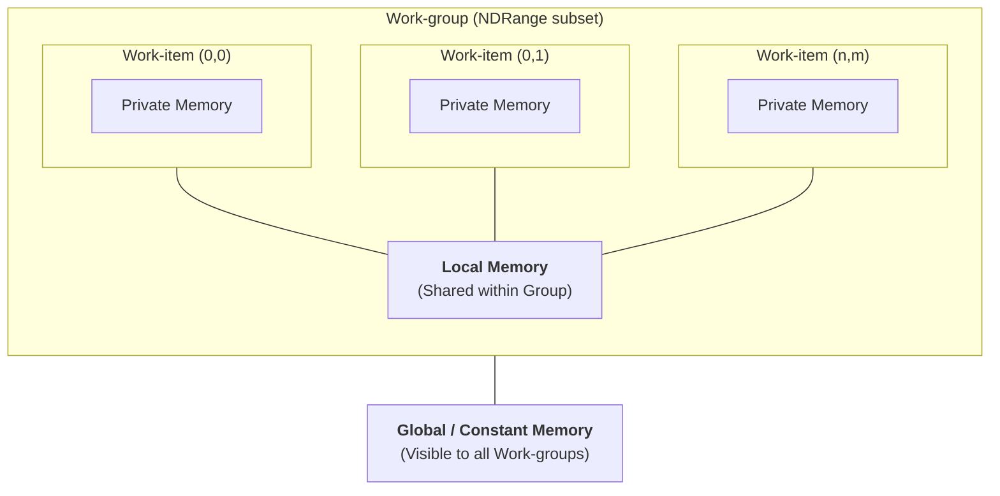

```mermaid
graph TD
    %% Global Structure
    subgraph NDRange [NDRange - Total Execution Domain]
        direction TB
        
        %% Work-groups
        subgraph WG1 [Work-Group 0,0]
            direction LR
            WI1_1((Work-item 0,0))
            WI1_2((Work-item 0,1))
            WI1_N(...)
        end
        
        subgraph WG2 [Work-Group 0,1]
            direction LR
            WI2_1((Work-item 1,0))
            WI2_2((Work-item 1,1))
            WI2_N(...)
        end
        
        subgraph WGN [Work-Group N,M]
            direction LR
            WIN_1((Work-item))
            WIN_2((Work-item))
            WIN_N(...)
        end
    end

    %% Memory/Resource Associations
    GlobalMem[(Global Memory)]
    LocalMem1[Local Memory - WG 0,0]
    LocalMem2[Local Memory - WG 0,1]
    
    %% Relationships
    GlobalMem --> WG1
    GlobalMem --> WG2
    GlobalMem --> WGN
    
    WG1 -.-> LocalMem1
    WG2 -.-> LocalMem2

    %% Styling
    style NDRange fill:#f9f,stroke:#333,stroke-width:2px
    style WG1 fill:#e1f5fe,stroke:#01579b
    style WG2 fill:#e1f5fe,stroke:#01579b
    style WGN fill:#e1f5fe,stroke:#01579b
```

```mermaid
graph TD
    subgraph WorkGroup ["Work-group (NDRange subset)"]
        direction TB
        subgraph WorkItem1 ["Work-item (0,0)"]
            P1["Private Memory"]
        end
        subgraph WorkItem2 ["Work-item (0,1)"]
            P2["Private Memory"]
        end
        subgraph WorkItem3 ["Work-item (n,m)"]
            P3["Private Memory"]
        end
        
        Local["<b>Local Memory</b><br/>(Shared within Group)"]
        
        WorkItem1 --- Local
        WorkItem2 --- Local
        WorkItem3 --- Local
    end

    Global["<b>Global / Constant Memory</b><br/>(Visible to all Work-groups)"]
    WorkGroup --- Global

```