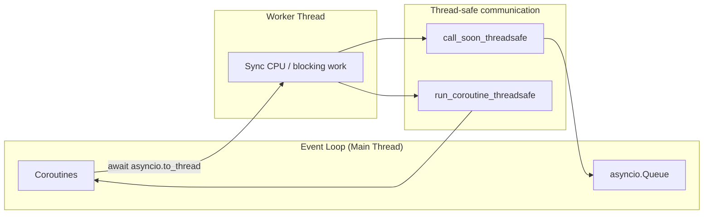

```mermaid
flowchart LR

subgraph LOOP["Event Loop (Main Thread)"]
    C1[Coroutines]
    Q[asyncio.Queue]
end

subgraph THREAD["Worker Thread"]
    W[Sync CPU / blocking work]
end

subgraph API["Thread-safe communication"]
    CS[call_soon_threadsafe]
    RC[run_coroutine_threadsafe]
end

C1 -->|await asyncio.to_thread| W

W --> CS
W --> RC

CS --> Q
RC --> C1
```