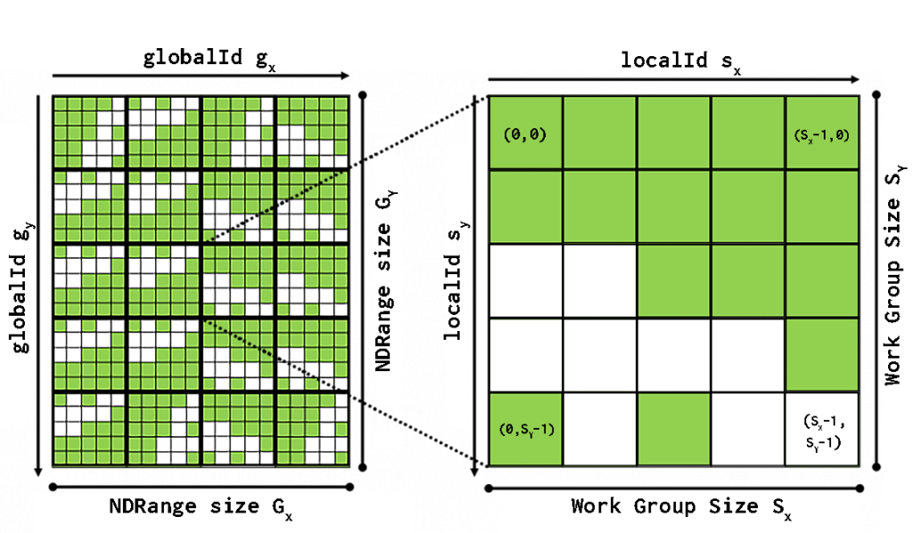
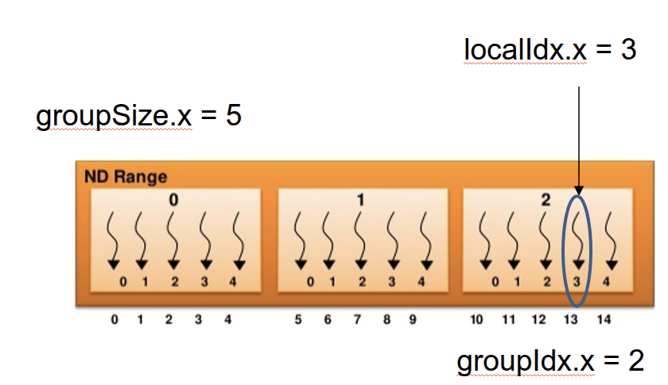
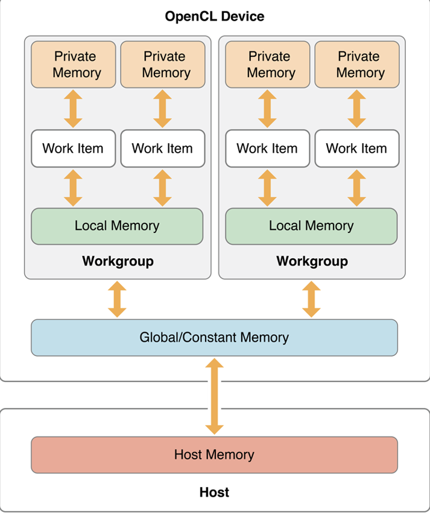
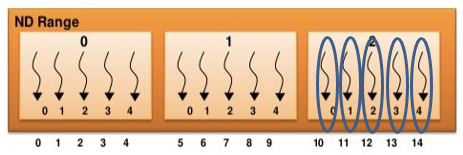
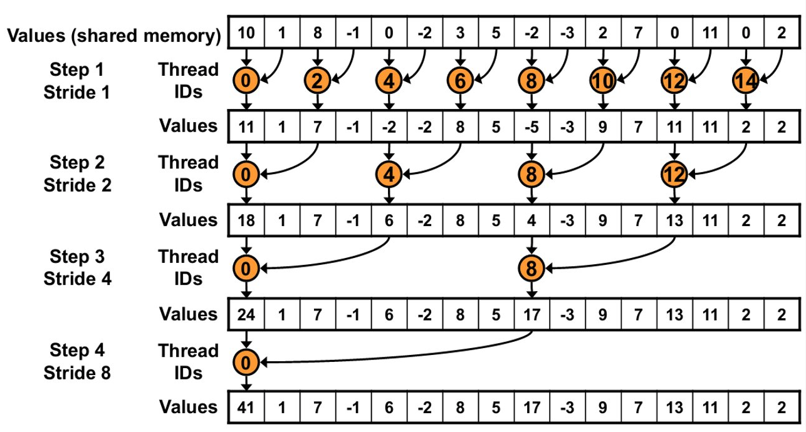

# Why Learn OpenCL?

GPU programming enables **massive parallelism**.

- Data‑parallel computation
- Thousands of concurrent threads
- SIMT execution model

Examples of GPU frameworks:

- CUDA
- OpenCL
- GLSL / HLSL shaders

OpenCL allows a **host application** to control multiple compute devices.

---

# OpenCL Devices

OpenCL can execute on
- GPU, CPU, FPGA, DSP, ...

Device structure composes of compute units and processing elements

Processing elements execute instructions using:
- SIMD
- SPMD

---

# Historical Context

Important milestones:

- 1992 — OpenGL standard
- 2007 — CUDA introduced
- 2008 — OpenCL 1.0 released
- 2013 — OpenCL 2.0 (Shared Virtual Memory)
- 2017 — OpenCL 2.2 (workgroup functions)
- 2020 — OpenCL 3.0

---

# Why OpenCL?

Advantages:

- Portable parallel code
- Works across hardware vendors
- Access to GPU acceleration
- Massive performance gains for heavy computation

Typical domains:

- Scientific computing
- Simulation
- Signal processing
- Rendering

---

# Example Application Domains

OpenCL is commonly used for:

- Particle simulations
- Molecular dynamics
- Matrix multiplication
- FFT
- Database search
- Volume rendering

---

# OpenCL Programming Model

**Setup**: Devices, Contexts, Command Queues

**Memory**: Buffers, Images

**Execution**: Programs, Kernels

**Synchronization**: Events, Pipes

---

# Kernels

A **kernel** is a C‑like function executed on the device
- Thousands of threads execute the same kernel
- Each work‑item processes **one element** and has its own **id**

```c
// id=0,1,....n-1
kernel void mul(global const float *a,
                   global const float *b,
                   global float *result)
{
    int id = get_global_id(0);
    result[id] = a[id] * b[id];
}
```


---

# Parallel Thinking

```c
// sequential
float *a;
float *b;
float *result;
for(int i=0;i<n;i++)
    result[i] = a[i] * b[i];
```
```c
// parallel
kernel void mul(global const float *a,
                   global const float *b,
                   global float *result) {
    int id = get_global_id(0);
    result[id] = a[id] * b[id];
}
```
---
# Async execution

Enqueuing commands in queue return Events that can be awaited
- `.wait()`

```python
a_np = np.random.rand(50000).astype(np.float32)
b_np = np.random.rand(50000).astype(np.float32)
# Move data to device
a_g = cl.Buffer(ctx, mf.READ_ONLY | mf.COPY_HOST_PTR, hostptr=a_np)
b_g = cl.Buffer(ctx, mf.READ_ONLY | mf.COPY_HOST_PTR, hostptr=b_np)
res_g = cl.Buffer(ctx, mf.WRITE_ONLY, a_np.nbytes)
prg = cl.Program(ctx, mul_kernel)
# enqueue the job
event_mul = prg.sum(queue, a_np.shape, None, a_g, b_g, res_g)
event_mul.wait()
```
---
# ND-Range



---
# # Work‑Groups & Work‑Items

Kernel execution creates many **work‑items**
Work‑items are grouped into **work‑groups**
Work‑groups are **independent**.
**Work-items** in a single **work-group** are executed on same device, can synchronize and share local memory!

```python
work_item_global_id = get_global_id() # globalID = groupSize * groupID + localID
work_item_local_id = get_local_id()
work_item_group_id = get_group_id()
group_size = get_local_size()
ndrange_size = get_global_size()
```
---
# Example

```c
int globalID = get_global_id(0); //13​
int localID = get_local_id(0); //3​
int groupID = get_group_id(0); //2
```


---

# Memory Model



---

# Address Space Qualifiers

OpenCL uses explicit memory qualifiers.
`__global, __local, __constant, __private`
```c
__kernel void vadd(__global const float *a, // read-only global memory
                   __global const float *b,
                   __local float* c,  // shared local memory work-group
                   __global float *result) // read/write global memory
{
    float k = 2.0f; // implicitly private
    int id = get_global_id(0);
    c[get_local_id(0)] = a[id] + b[id]; // shared memory in work-group
    ...
    result[get_group_id(0)] = c[0];
}
```

---

# Synchronization
```c
__kernel void foo(__global const float *a,
                   __local float* c  // shared local memory work-group
{
    int id = get_global_id(0);
    c[get_local_id(0)] = a[id] * 3.0f; // shared memory in work-group
    barrier(CLK_LOCAL_MEM_FENCE); // SYNC
    group_id = get_group_id(0); // group_id == 2
    result[group_id] = c[0];
}
```


---

# Atomic Operations

Atomic operations prevent race conditions.

```
atomic_add
atomic_sub
atomic_inc
atomic_dec
atomic_min
atomic_max
```


```c
uint old_val = atomic_inc(counter);
```

---
# Simple histogram

```c
_kernel void simple_histogram(
    __global const uint* data,
    __global uint* histogram,
    const uint num_elements)
{
    int gid = get_global_id(0);

    if (gid < num_elements) {
        uint value = data[gid];
        atomic_inc(&histogram[value]);
    }
}
```

---

# Reduction Pattern

Many GPU algorithms use **reductions**.

Example:

- Sum of array values.

Strategy:

1. Load values into local memory
2. Perform partial reductions
3. Write result per work‑group

---
# Example Reduction Kernel

```c
__kernel void sum(__global int *X,
                  __local int *sdata,
                  __global int *Y) {
    int tid = get_local_id(0);
    int i = get_global_id(0);
    sdata[tid] = X[i];
    barrier(CLK_LOCAL_MEM_FENCE);
    for(int s = get_local_size(0)/2; s > 0; s >>= 1) {
        if(tid < s)
            sdata[tid] += sdata[tid+s];
        barrier(CLK_LOCAL_MEM_FENCE);
    }
    if(tid == 0)
        Y[get_group_id(0)] = sdata[0];
}
```
---
# Reduction Kernel - explained



---
# Summary

PyOpenCL provides a Python interface for OpenCL.
- Python host code
- GPU kernels in OpenCL C
- Easy memory management
- asynchronous execution
- event objects
- non‑blocking kernel launches

---
# Task: Game of Life
Grid rules: each cell is either **alive (1)** or **dead (0)**.
At each step:
- A live cell with <2 or >3 neighbors dies
- A live cell with 2–3 neighbors survives
- A dead cell with exactly 3 neighbors becomes alive

• Use **OpenCL kernel** to update the grid
• Each **work-item computes one cell**
• Grid should update for many iterations
• Visualize the grid using **matplotlib**

Hints
- Carefully handle boundary cells
