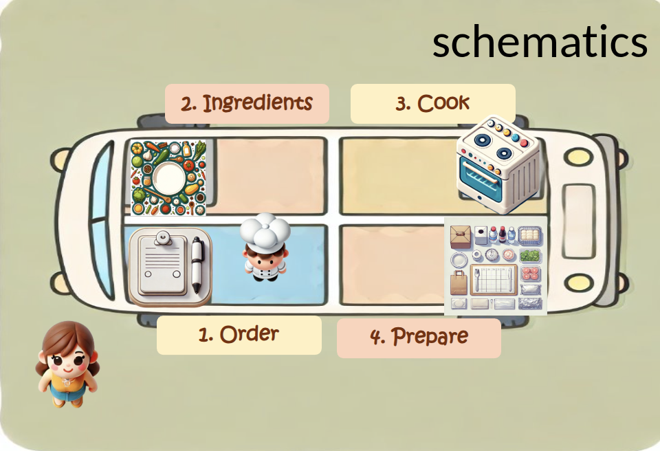
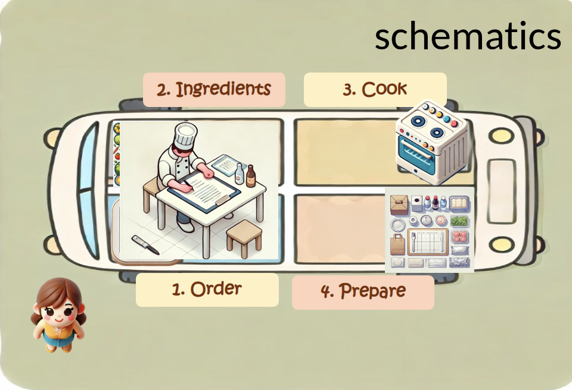
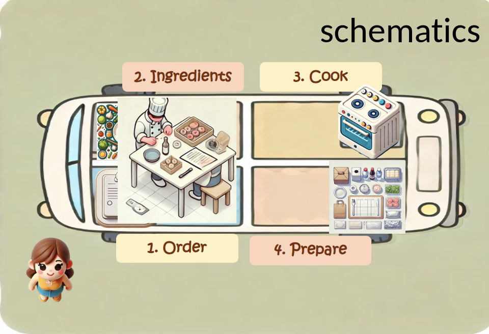
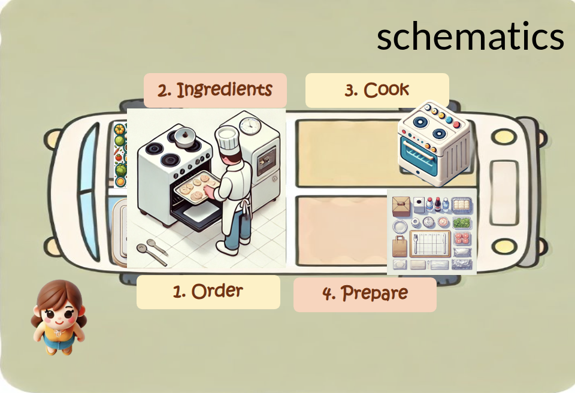
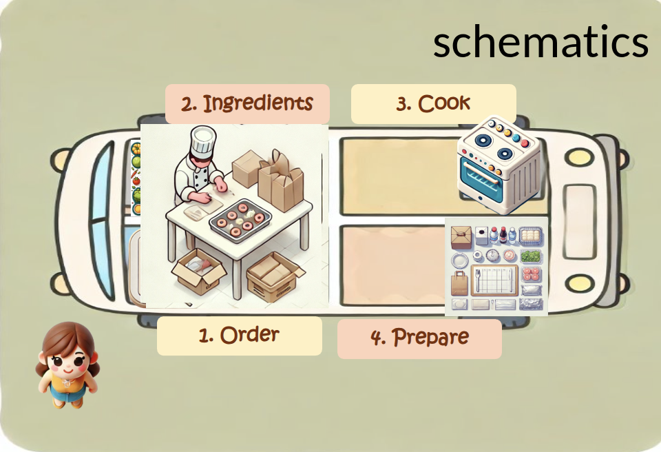
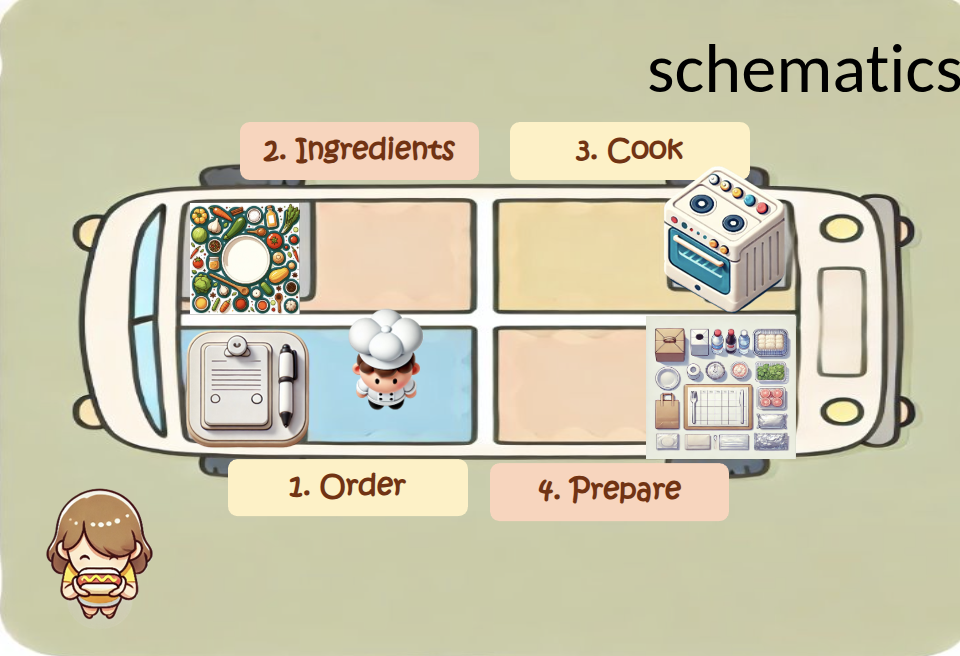

# Execution Model

Understand the execution model

Modern systems:

- Handle many independent jobs
- Mix I/O and heavy computation
- Scale across cores and accelerators

---

# Synchronous Execution

Typical python programs start with:

- **One process**
- **One thread**
- **One execution path**
- **Sequential control flow**

The program executes **top → bottom**.

---


---


---


---


---


---


---

# Foodtruck: Sequential Pipeline

```python
for i in range(5):
    order = producer()
    order = ingredients(order)
    order = cook(order)
    order = prepare(order)
    customer(order)
```

Each step **blocks** until it finishes.

Nothing else runs while `cook()` executes.

---

# Blocking Behavior

In synchronous programs:

```python
load_data()   # waits
compute()     # waits
save_data()   # waits
```

Every step **owns the thread** until it returns.

This model is simple, but inefficient for many workloads.

---

# Strengths of Synchronous Code

- Deterministic execution order
- Easy reasoning and debugging  
- Clear stack traces  
- No race conditions by default

---

# Limitations of Synchronous Code

- Cannot mix waiting with other work
- Waste time during I/O
- Cannot utilize multiple CPU cores
- Scale poorly for large numbers of tasks

---

# Concurrency
Allowing more than one task to be handled at the same time
- broader term than parallelism, ie. multiple tasks have the ability to run in an **overlapping manner**
- we **switch** between tasks
    - baker starts a second cake while the first is in owen

Concurrency is about **managing** many things at once, but **not necessarily doing** them at the exact same instant.

---

# Parallelism

Executing multiple operations at the **exact same time**
- Concurrency can happen on a single-core CPU via "time slicing," 
- Parallelism **requires a CPU / GPU with multiple cores or multiple machines**.
    - Two distinct bakers working on two different cakes simultaneously

Parallelism implies concurrency, but concurrency does not always imply parallelism

---
# Understanding the Bottlenecks
- I/O-Bound
    - The application spends most of its time waiting on a **network, disk, or other I/O device**
    - Downloading web pages, querying a database, or reading files

- CPU-Bound
    - The application is limited by the **clock speed and cores of the CPU**
    - Mathematical computations, image processing, or looping over large datasets

---

# I/O-Bound vs CPU-bound Workloads

In I/O Bound program spends most time **waiting** for external systems:
- These workloads benefit from **concurrency**
- **asyncio**, threading - **GIL**

In CPU-Bound program spends most time **computing**:
- These workloads benefit from **parallelism**
- multiprocessing, **free-threaded python**, **opencl**

---

# What is GIL?
**Global Interpreter Lock**
- mechanism that prevents one Python process from executing more than one Python bytecode instruction at any given time
- This makes standard multithreading ineffective for speeding up CPU-bound tasks

---

# Why is GIL Needed?

GIL exists primarily because of how **CPython manages memory**

**Reference Counting**: 
- Python tracks how many places reference an object. 
- When the count reaches zero, the object is deleted
- **not thread-safe**, without GIL, two threads could increment a reference count simultaneously
- GIL is to prevent these raise conditions

---

# When is GIL Released?
The GIL is not held forever and is released during **I/O operations**.
- Low-level system calls for I/O happen outside the Python runtime.

- **Asyncio** to handle many I/O-bound tasks concurrently

For CPU-bound Python code, the GIL remains locked
- **Multiprocessing** / **Free-Threaded (No-GIL) Python** for true parallelism

---

# Implications for Python Programs

| Workload | Best Tool |
|------|------|
| High I/O concurrency | Asyncio |
| I/O with blocking libraries | Threads |
| Heavy CPU computation | Multiprocessing |
| CPU scaling | Free-threaded Python |

---

# Key Takeaways

- Default Python execution is **synchronous**  
- **Concurrency** manages many tasks  
- **Parallelism** executes tasks simultaneously  
- Python threads are limited by the **GIL**  
- Different workloads require different models
---

# Tasks - sync foodtruck
- Add Timing Information
    - Understand where time is spent.
    - Measure time spent in each stage (ingredients, cook, prepare) and total time per order. Print the timings when an order is completed.
- Process Multiple Orders
    - See how blocking affects throughput.
    - Increase the number of orders (e.g. from 5 to 20). Add a timestamp before starting each order.
