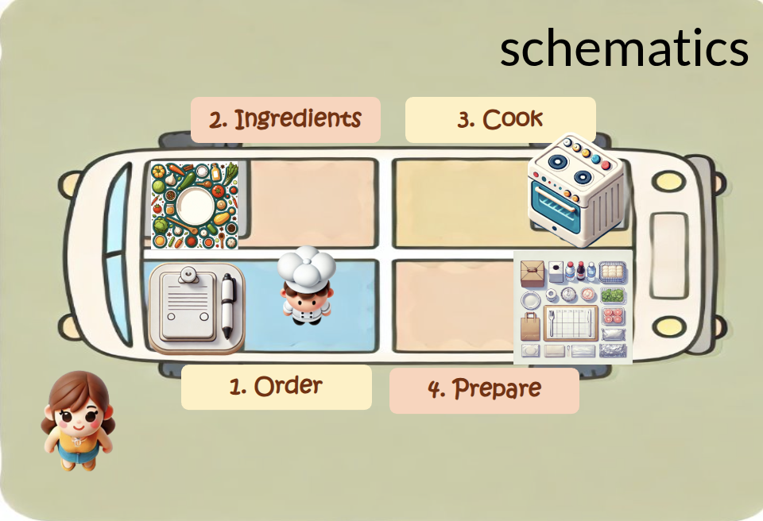
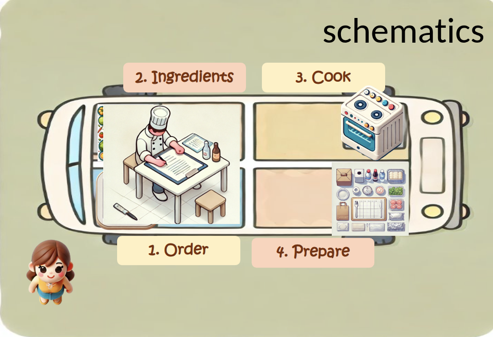
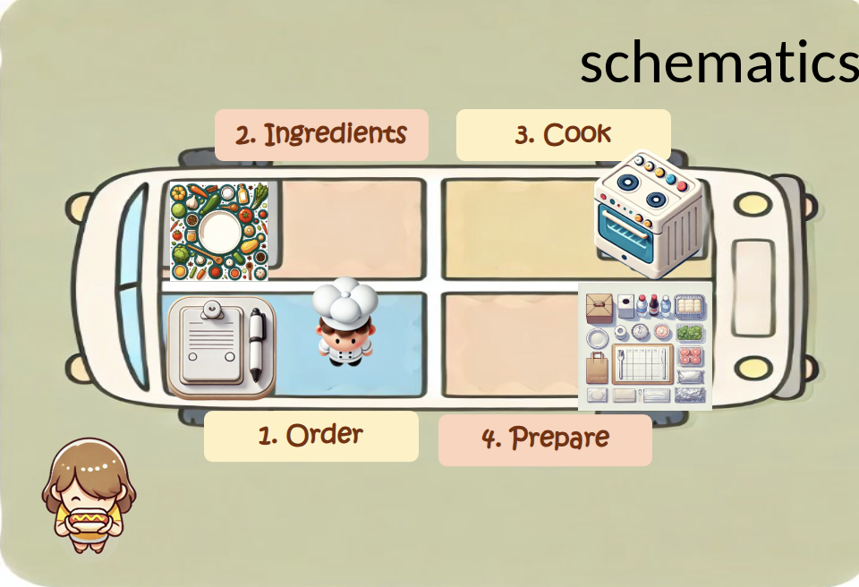

# From Concurrency to Full Parallelism in Modern Python

## Choosing the right execution model

### An interactive tour of concurrency and parallelism

Julius Parulek

<!-- 40 minutes. The format is always: predict, vote, run, explain. -->

---

# How this talk works

For every example:

1. **Predict** the output or duration
2. **Vote**: A, B, or C
3. **Run** the example
4. **Explain** the execution model

Do not optimize for getting every answer right.

Optimize for finding the rule that predicts the next one.

---

# The running idea

> When one job is waiting, what else can Python do?

We will move through four models:

- synchronous execution
- asynchronous concurrency
- async orchestration plus threads
- free-threaded CPU parallelism

---

# The food truck



Five customers arrive.

Each order goes through:

```text
order -> ingredients -> cook -> prepare -> customer
```

How long will five orders take?

- A: about 8 seconds
- B: about 40 seconds
- C: it depends only on the number of CPU cores

---

# Watch the pipeline



```python
for order_id in range(5):
    order = order_stage(order_id)
    order = ingredients(order)
    order = cook(order)
    order = prepare(order)
    customer(order)
```

Run: [`food_sync.py`](../../examples/food_sync/food_sync.py)

---

# Sequential execution



One order owns the thread until its stage returns.

```text
one order: 1 + 2 + 3 + 1 = 7 seconds
five orders: 5 x 7 = 35 seconds
```

The machine is often waiting, but the program has no other work to schedule.

---

# Concurrency or parallelism?

Which statement is correct?

- A. Concurrency and parallelism mean the same thing
- B. Concurrency is overlapping progress; parallelism is simultaneous execution
- C. Parallelism works on only one CPU core

Take 20 seconds. Explain your choice to someone nearby.

---

# Two kinds of waiting

## I/O-bound

The program waits for a network, disk, database, or timer.

## CPU-bound

The program spends its time executing calculations.

Which workload should benefit most from `asyncio`?

- A: 10,000 HTTP requests
- B: two pure-Python image calculations
- C: neither

---

# The GIL

The Global Interpreter Lock means standard CPython generally allows only one
thread to execute Python bytecode at a time.

On ordinary CPython, will two Python threads make this faster?

```python
def work():
    total = 0
    for _ in range(10**8):
        total += 1
```

- A: usually yes
- B: usually no for pure Python CPU work
- C: only if the function is declared `async`

---

# Asyncio: the first surprise

```python
async def greet():
    print("hello")

greet()
print("finished")
```

What is printed?

- A: `hello`, then `finished`
- B: `finished`, and possibly a warning
- C: nothing

---

# `async def` is not execution

Calling an async function creates a **coroutine object**.

It runs only when it is awaited or scheduled as a task.

```python
await greet()
```

or:

```python
task = asyncio.create_task(greet())
```

`async` describes a possible suspension point. It does not promise parallelism.

---

# Two sleeps

```python
async def job(seconds):
    await asyncio.sleep(seconds)

task_a = asyncio.create_task(job(2))
task_b = asyncio.create_task(job(3))

await task_a
await task_b
```

How long?

- A: 2 seconds
- B: 3 seconds
- C: 5 seconds

---

# Tasks overlap while waiting

Both tasks are scheduled before the first result is awaited.

```text
time: 0 ---- 2 -------- 3
task A:     [==========]
task B:     [===============]
```

**Answer: approximately 3 seconds.**

Run: [`sleep_job.py`](../../examples/async_demo/sleep_job.py)

---

# Mixed awaits

From [`execution_ex.md`](execution_ex.md):

```python
sleep2 = asyncio.create_task(my_job(2))
sleep3 = asyncio.create_task(my_job(3))

await my_job(2)
await sleep2
await sleep3
```

What is the total duration?

- A: about 2 seconds
- B: about 3 seconds
- C: about 7 seconds

---

# The task was already running

While the direct `await my_job(2)` is waiting:

- `sleep2` is also progressing
- `sleep3` is also progressing

At two seconds, `sleep2` is already complete.
At three seconds, `sleep3` is complete.

**Answer: approximately 3 seconds.**

The important distinction is not “which line appears first?”
It is “which work has been scheduled already?”

---

# `gather` result order

```python
results = await asyncio.gather(
    asyncio.sleep(3, result="A"),
    asyncio.sleep(1, result="B"),
)
print(results)
```

What is printed?

- A: `['A', 'B']`
- B: `['B', 'A']`
- C: whichever task finishes first, with no guarantee

---

# Completion order is not result order

`asyncio.gather` returns results in the same order as its inputs.

```text
completion: B, then A
results:    A, then B
```

This is useful when the input position identifies the job.
It can be surprising when the application needs streaming results instead.

---

# The event loop in one picture

```text
                 ready tasks
                     |
                     v
     I/O events -> event loop -> resumed coroutines
                     ^
                     |
                 await points
```

The loop runs one task at a time until that task:

- finishes
- reaches an `await`
- raises an exception

---

# CPU work inside asyncio

```python
async def cpu_job(n):
    total = 0
    for i in range(n):
        total += i
    return total

task_a = asyncio.create_task(cpu_job(10**8))
task_b = asyncio.create_task(cpu_job(10**8))
task_sleep = asyncio.create_task(asyncio.sleep(2))
```

Does the sleep run while the CPU jobs execute?

- A: yes, tasks always share the time
- B: no, the CPU coroutine never yields
- C: only if `gather` is used

---

# Cooperative means cooperative

`asyncio` cannot interrupt a coroutine that never yields.

```text
CPU job A: [====================]
CPU job B:                       [====================]
sleep:                           waits in the queue
```

Asyncio is excellent at **latency hiding for I/O**.
It is not a CPU parallelism mechanism.

Run: [`io_cpu_bound.py`](../../examples/async_demo/io_cpu_bound.py)

---

# Is this file access async?

```python
async def read_file(path):
    with open(path, "rb") as file:
        return file.read()

await asyncio.gather(
    read_file("file1"),
    read_file("file2"),
)
```

Does `asyncio.gather` make the reads non-blocking?

- A: yes, because the function is `async`
- B: no, `read()` still blocks the event-loop thread
- C: only if there are two files

---

# Syntax does not change the underlying operation

This is still synchronous file I/O running on the event-loop thread.

Move the blocking function away from the loop:

```python
content = await asyncio.to_thread(read_file, path)
```

Now the event loop can schedule other coroutines while the worker thread waits.

---

# What does `to_thread` solve?

```python
await asyncio.gather(
    asyncio.to_thread(read_file, "file1"),
    asyncio.to_thread(read_file, "file2"),
)
```

Which statement is best?

- A: It makes every Python calculation run in parallel
- B: It keeps blocking work from freezing the event loop
- C: It removes the need for synchronization

---

# The hybrid architecture

```text
asyncio event loop
       |
       | schedules and coordinates
       v
threads / processes
       |
       v
blocking or CPU-heavy work
```

The event loop is the coordinator.
The workers perform work that should not occupy the loop.

---

# One hundred workers

```python
tasks = [
    asyncio.to_thread(cpu_work, 50_000_000)
    for _ in range(100)
]
await asyncio.gather(*tasks)
```

Is this automatically a good design?

- A: yes, more tasks always means more speed
- B: no, bound concurrency to protect CPU and memory
- C: no, because `gather` cannot run threads

---

# Bounded concurrency

```python
sem = asyncio.Semaphore(8)

async def worker():
    async with sem:
        return await asyncio.to_thread(cpu_work, 50_000_000)
```

The number of tasks and the number of active workers are different decisions.

Use a queue, worker pool, or semaphore when resources are limited.

---

# Free-threaded Python

```python
await asyncio.gather(
    asyncio.to_thread(cpu_work, 50_000_000),
    asyncio.to_thread(cpu_work, 50_000_000),
)
```

**When can this provide true Python-level CPU parallelism?**

- A: in every Python installation
- B: in a free-threaded build such as Python 3.13t
- C: only when the function contains `await`

---

# Two layers, two jobs

```text
asyncio:    coordinate and communicate
threads:    execute synchronous work
no-GIL:     allow Python threads to execute in parallel
```

Free-threaded Python changes the CPU-bound case, but it also exposes real
shared-memory races. Locks, queues, and ownership still matter.

Run: [`ft_job.py`](../../examples/async_demo/ft_job.py)

---

# How does a thread report back?

```python
def worker(loop, queue):
    result = cpu_work()
    loop.call_soon_threadsafe(queue.put_nowait, result)
```

Why not call `queue.put_nowait` directly?

- A: the worker may be running outside the event-loop thread
- B: queues can only contain strings
- C: `call_soon_threadsafe` makes CPU work faster

---

# Communicate across the boundary

Use thread-safe scheduling to send a message back to the loop:

```python
loop.call_soon_threadsafe(queue.put_nowait, message)
```

The preferred shape is often:

```text
worker owns computation
queue carries messages
event loop owns async coordination
```

---

# Choose the model

For each workload, choose one:

1. `asyncio`
2. threads or processes
3. async plus workers

**A.** 10,000 slow HTTP requests

**B.** A pure-Python numerical calculation on a free-threaded build

**C.** A service that downloads data and then performs heavy calculations

---

# The decision table

| Workload | First tool to consider |
|---|---|
| Many I/O waits | `asyncio` |
| Blocking library | `asyncio.to_thread` or a worker pool |
| Pure-Python CPU work | processes, or free-threaded threads |
| Mixed I/O and CPU | async orchestration plus workers |
| Shared state | queues, ownership, and explicit synchronization |

The right choice is not simply “use async.”

It is “where does this program spend its time?”

---

# The three rules to take home

1. **`async` does not mean parallel.**
2. **`await` creates a chance for other work to run.**
3. **CPU work needs a parallel execution mechanism.**

And the recurring idea:

> When this job is waiting, who should use the time?

---

# One last vote

Complete the sentence:

> I would use `asyncio` when ...

> I would use threads or processes when ...

> I would combine them when ...

Then run one of the examples again and predict its duration before pressing Enter.
