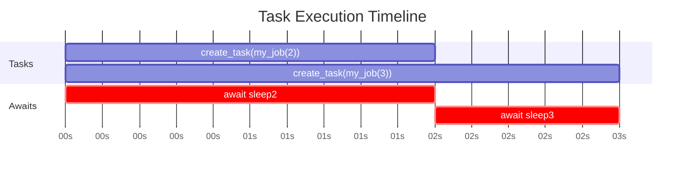

```mermaid
gantt
    title Task Execution Timeline
    dateFormat s
    axisFormat %Ss
    section Tasks
    create_task(my_job(2))  :a, 0, 2s
    create_task(my_job(3))  :b, 0, 3s
    section Awaits
    await sleep2            :crit, 0, 2s
    await sleep3            :crit, 2, 1s
```